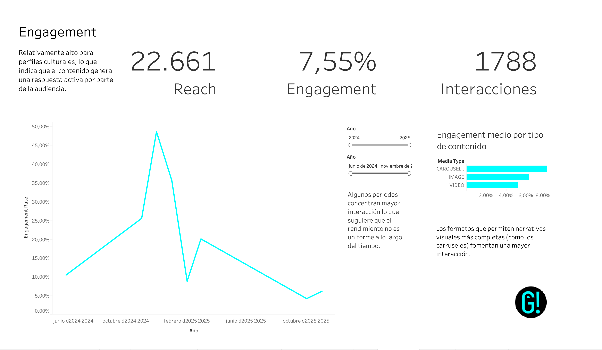
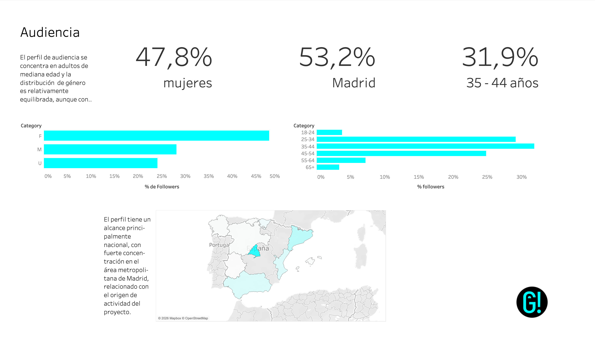
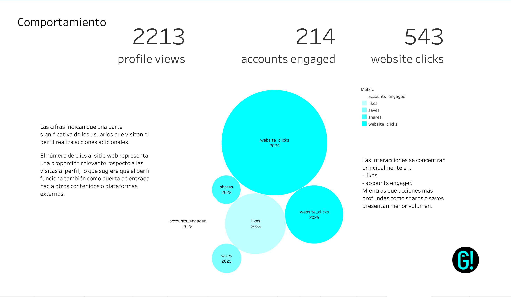

# Instagram Audience Analytics
# Análisis del rendimiento del perfil de IG de enGira! 
### Audiencia, engagement y comportamiento mediante dashboards interactivos

## 📌 Descripción del proyecto

Este proyecto analiza el rendimiento de una cuenta de Instagram mediante técnicas de **análisis de datos y visualización interactiva en Tableau**.

A partir de datos extraídos mediante la **Instagram Graph API**, se estudian tres dimensiones principales del comportamiento de la audiencia:

- **Engagement con el contenido**
- **Perfil demográfico y geográfico de la audiencia**
- **Patrones de interacción con el perfil**

El objetivo del análisis es comprender **cómo interactúan los usuarios con el perfil y qué factores influyen en el rendimiento del contenido**, con el fin de identificar oportunidades de mejora en la estrategia de comunicación digital.

---
## 🛠️ Tecnologías utilizadas

- **Python**
- **Pandas**
- **NumPy**
- **Tableau**
- **Jupyter Notebook**
- **Instagram Graph API**
- **Git / GitHub**

---

## ⚙️ Automatización del proceso

Ahora el proyecto también incluye un pipeline ejecutable desde terminal para evitar rehacer manualmente los notebooks cada vez.

### 1. Configura tus credenciales

Crea un archivo `.env` en la raíz del proyecto con estas variables:

```bash
ACCESS_TOKEN=tu_token_de_instagram_graph_api
IG_USER_ID=tu_instagram_user_id
IG_CREATION_DATE=2024-06-25
IG_API_VERSION=v21.0
```

Puedes partir de `.env.example` y crear tu `.env` real a partir de ahí. Ese archivo `.env` está ignorado por git y no se sube al repositorio.

`IG_CREATION_DATE` e `IG_API_VERSION` son opcionales. Si no los defines, el script usa `2024-06-25` y `v21.0`.

### 2. Instala dependencias

```bash
make install
```

### 3. Ejecuta el pipeline

```bash
make pipeline
```

Eso hace en un solo paso:

- extraer métricas globales desde la API
- extraer demographic breakdowns (`age`, `gender`, `country`, `city`)
- extraer insights de publicaciones
- regenerar los CSV preparados para Tableau

Si quieres regenerar rápido los CSV sin pedir `media_insights`, usa:

```bash
make pipeline-fast
```

También puedes lanzar cada fase por separado:

```bash
make extract
make transform
```

### Archivos que genera

- `data/processed/ig_totals_since_creation.csv`
- `data/processed/ig_totals_by_window_long.csv`
- `data/processed/ig_follower_demographics_age.csv`
- `data/processed/ig_follower_demographics_gender.csv`
- `data/processed/ig_follower_demographics_country.csv`
- `data/processed/ig_follower_demographics_city.csv`
- `data/raw/media_insights.csv`
- `data/raw/total_metrics.csv`
- `data/raw/total_metrics_by_window.csv`
- `data/raw/demographics_IG.csv`
- `data/raw/geographics_IG.csv`

---

## 📁 Estructura del proyecto

```bash
INSTAGRAM_AUDIENCE_ANALYTICS/
│
├── README.md
├── Makefile
├── requirements.txt
│
├── data/
│   ├── raw/
│   │   ├── demographics_IG.csv
│   │   ├── geographics_IG.csv
│   │   ├── media_insights.csv
│   │   ├── total_metrics_by_window.csv
│   │   └── total_metrics.csv
│   │
│   └── processed/
│       ├── ig_follower_demographics_age.csv
│       ├── ig_follower_demographics_city.csv
│       ├── ig_follower_demographics_country.csv
│       ├── ig_follower_demographics_gender.csv
│       ├── ig_totals_by_window_long.csv
│       └── ig_totals_since_creation.csv
│
├── notebooks/
│   ├── extraccion_datos_api.ipynb
│   ├── eda_ig.ipynb
│   ├── eda_insights.ipynb
│   ├── insights_media.ipynb
│   ├── union_limpieza.ipynb
│   └── union_limpieza copy.ipynb
│
├── scripts/
│   └── instagram_pipeline.py
│
├── reports/
│   ├── dashboards/
│   │   └── Análisis audiencia enGira!OK.twbx
│   │
│   └── figures/
│       ├── audience.png
│       ├── comportamiento.png
│       └── engagement.png
│
└── logo/
    └── favicon_eg_black.png
```

---

# 🗂️ Dashboards

El proyecto se organiza en **tres dashboards principales**, cada uno centrado en un aspecto del rendimiento del perfil.

---

## 1️⃣ Dashboard de Engagement

Analiza el nivel de interacción que generan las publicaciones.

### Indicadores analizados

- Engagement rate
- Número de interacciones
- Alcance de las publicaciones
- Engagement por tipo de contenido

### Insights principales

- El perfil presenta un **engagement del 7,55 %**, indicando una audiencia activa.
- Los **carruseles generan mayor interacción** que imágenes o vídeos.
- El engagement presenta **variaciones a lo largo del tiempo**, con picos en determinados periodos.

### 📊 Vista previa del dashboard



---

## 2️⃣ Dashboard de Audiencia

Describe el perfil demográfico y geográfico de los seguidores.

### Variables analizadas

- Distribución por género
- Distribución por grupos de edad
- Distribución geográfica por países
- Distribución por comunidades autónomas

### Insights principales

- La audiencia está **ligeramente feminizada (47,8 %)**.
- El grupo de edad predominante es **35–44 años**.
- La audiencia se concentra principalmente en **España**, con un peso destacado de **Madrid (53,2 %)**.

### 📊 Vista previa del dashboard



---

## 3️⃣ Dashboard de Comportamiento

Analiza cómo interactúan los usuarios con el perfil.

### Métricas analizadas

- Visitas al perfil
- Cuentas que interactúan
- Interacciones totales
- Clics al sitio web
- Tipos de interacción (likes, comentarios, compartidos, guardados)

### Insights principales

- El perfil registra **2213 visitas al perfil y 214 cuentas que interactúan**.
- Se generan **543 clics al sitio web**, lo que indica capacidad de conversión.
- La mayoría de las interacciones corresponden a **likes**, mientras que comentarios y compartidos presentan menor volumen.

### 📊 Vista previa del dashboard



---

# 🛠️ Herramientas utilizadas

- **Python**
  - extracción de datos mediante **Instagram Graph API**
  - limpieza y transformación de datasets con **Pandas**

- **Tableau**
  - creación de dashboards interactivos
  - visualización y análisis exploratorio de datos

---

# 📊 Fuentes de datos

Los datos utilizados proceden de la **Instagram Graph API**, que permite acceder a métricas de rendimiento del perfil y de las publicaciones.

Entre las métricas analizadas se incluyen:

- reach  
- impressions  
- accounts engaged  
- profile views  
- website clicks  
- likes  
- comments  
- shares  
- saves  

---

# 🎯 Objetivo del análisis

El objetivo principal del proyecto es **identificar patrones de comportamiento de la audiencia y evaluar el rendimiento del contenido**, con el fin de mejorar la estrategia de comunicación en redes sociales.

El análisis permite identificar:

- qué tipos de contenido generan mayor interacción
- cuál es el perfil demográfico de la audiencia
- cómo interactúan los usuarios con el perfil
- en qué medida el perfil dirige tráfico hacia otras plataformas

---

# 📈 Conclusiones

El perfil presenta **niveles de engagement relativamente elevados**, lo que indica que el contenido resulta relevante para la audiencia.

El formato de publicación influye significativamente en el rendimiento, destacando los **carruseles como el tipo de contenido con mayor capacidad de interacción**.

La audiencia se concentra principalmente en **España y en usuarios adultos entre 25 y 44 años**, lo que sugiere un perfil demográfico relativamente definido.

Además, el perfil no solo genera interacción dentro de la plataforma, sino que también funciona como **canal de tráfico hacia otros contenidos**, evidenciado por el número de clics al sitio web.

---

# 🚀 Posibles mejoras futuras

- análisis del rendimiento por tipo de publicación (post, reel, story)
- análisis de la evolución temporal de seguidores
- estudio de correlación entre tipo de contenido y engagement
- integración de datos de múltiples redes sociales

# Autora
**María Moral**  
Análisis de datos aplicado a la gestión cultural 

[LinkedIn](www.linkedin.com/in/maria-moral-7862a24b) 
